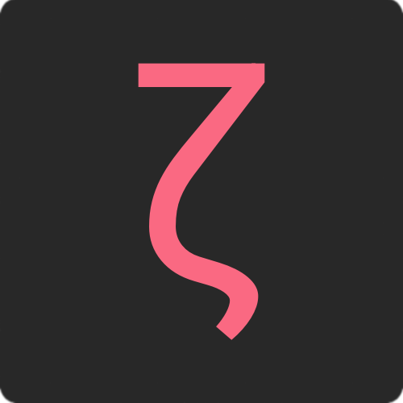

<div align='center'>
  

  <br />

  <p>
    
    
    <a href="https://github.com/kauefraga/zetashort/commits/main">
      
    </a>
    
  </p>
</div>

> 🔗 An URL shortener.

> [!IMPORTANT]
> 🚧 Work in progress

### Features

## ⬇️ Getting Started

### How to install, build and run it

1. Clone the repository
2. Install dependencies
3. Build and start 😉

```bash
# (1)
git clone https://github.com/kauefraga/zetashort.git
cd zetashort

# (2)
pnpm i --frozen-lockfile

# (3)
pnpm build
pnpm start
```

### Usage

## 💪 How to contribute

Feel free to open an [issue](https://github.com/kauefraga/zetashort/issues). I would love to read and fix the bugs you spotted.

If you want to contribute with your code, follow it:

1. With the repository forked and cloned, start the development mode
2. Develop something cool
3. Open a pull request

```bash
# (1)
pnpm dev
```

## 📝 License

This project is licensed under the MIT License - See the [LICENSE](https://github.com/kauefraga/zetashort/blob/main/LICENSE) for more information.
